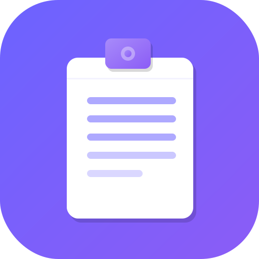

<div align="center">



# D18 Notes

**A secure, self-hosted personal notes app — no database required.**

[](https://php.net)
[](https://web.dev/progressive-web-apps/)
[](https://www.php.net/manual/en/function.openssl-encrypt.php)
[](LICENSE)
[](https://digital18.in)

*Write notes. Stay private. No setup hassle.*

</div>

---

## What is D18 Notes?

D18 Notes is a **self-hosted personal notes app** built entirely in PHP — no framework, no database, no cloud dependency. All your notes are stored locally in a single **AES-256-CBC encrypted file** that nobody can read without your secret key.

It looks and feels like a modern chat app, works offline as a PWA, and auto-updates in real-time across browser tabs.

---

## ✨ Features

### 🔐 Authentication & Security
- **Bcrypt password hashing** — plain-text password never stored anywhere
- **Math CAPTCHA** on login — prevents brute-force and bots
- **AES-256-CBC encryption** — `notes.dat` is unreadable without your secret key
- **Random IV per write** — identical content produces different ciphertext every time
- **Session protection** — session ID regenerated on login, secure cookie flags
- **`.htaccess` file locks** — `config.php`, `notes.dat`, `make_hash.php` blocked from direct browser access

### 📝 Notes Interface
- **Chat-style layout** — notes displayed as chat bubbles, newest at bottom
- **Date separators** — "Today", "Yesterday", full date for older notes
- **Shift+Enter** for new line, **Enter** to send
- **Auto-scroll** to latest note on page load
- **Live auto-refresh** every 4 seconds — new notes appear without page reload
- **"↓ New notes"** floating button when scrolled up and new notes arrive
- **Select text → Copy tooltip** — select any text in a bubble to get a clipboard copy button

### 🔍 Search
- **Live full-text search** across all notes as you type
- **Highlighted keywords** in results
- **Keyboard navigation** — ↑ ↓ to browse, Enter to jump, Escape to close
- **Click result** → smooth scroll + pulse animation on the target note

### ℹ️ Per-Note Metadata
- Saves **IP address**, **browser name**, and **geolocation** (city, region, country) with every note
- Two compact icon buttons per note:
  - **ℹ** — hover or tap to see metadata in a dark tooltip
  - **🗑** — delete with confirmation
- Icons appear on hover (desktop) or always visible (touch devices)

### 📱 Progressive Web App (PWA)
- **Installable** on Android, iOS, and Desktop (Chrome, Edge, Safari)
- **Custom SVG icon** with PNG fallback (generated via PHP GD)
- **Offline fallback page** — friendly message when no connection
- **Service worker** caches fonts and static assets for fast repeat loads
- **Theme color** — purple system chrome on mobile
- **"⬇ Install" button** in header (appears when installable)

### 🚫 No Database
- Everything stored in a single encrypted file (`notes.dat`)
- Works on **any PHP host** — shared hosting, VPS, even localhost
- No MySQL, no PostgreSQL, no Redis — zero DB setup

---

## 🛠️ Tech Stack

| Layer | Technology |
|-------|-----------|
| Backend | PHP 7.4+ (procedural, no framework) |
| Data storage | AES-256-CBC encrypted JSON file |
| Encryption | PHP `openssl_encrypt` / `openssl_decrypt` |
| Password hashing | PHP `password_hash` / `password_verify` (bcrypt, cost=12) |
| Frontend | Vanilla HTML5, CSS3, ES6 JavaScript |
| Fonts | Google Fonts — Inter |
| PWA | Web App Manifest + Service Worker |
| Geolocation | [ip-api.com](http://ip-api.com) (free, no key required) |
| Icons | SVG + PHP GD (PNG generation) |

---

## 🚀 Quick Start

### Requirements
- PHP **7.4+** with `openssl` extension (enabled by default on most hosts)
- A web server (Apache, Nginx, or Laravel Herd locally)
- **No database required**

### Installation

**1. Clone the repository**
```bash
git clone https://github.com/yourusername/d18notes.git
cd d18notes
```

**2. Copy and configure**
```bash
cp config.example.php config.php
```

Open `config.php` and update:
```php
define('APP_PASSWORD_HASH', '');        // Leave empty for now — see Step 3
define('ENCRYPT_SECRET',    'change-this-to-a-long-random-phrase-you-will-remember');
```

**3. Generate your password hash**

Upload `make_hash.php` to your server, open it in a browser, enter your password, copy the hash, paste it into `config.php` as `APP_PASSWORD_HASH`, then **delete `make_hash.php`**.

```php
define('APP_PASSWORD_HASH', '$2y$12$your_generated_hash_here...');
```

**4. Upload to your server**

Upload all files. Ensure the web root directory is **writable** by PHP so `notes.dat` can be created.

**5. Open in browser**

```
https://yourdomain.com/notes/login.php
```

That's it. The encrypted `notes.dat` file is created automatically on your first note.

---

## ⚙️ Configuration

All configuration lives in `config.php`:

```php
// ── Password (bcrypt hash) ────────────────────────────────────────────────
// Generate via make_hash.php — NEVER store plain text here
define('APP_PASSWORD_HASH', '$2y$12$...');

// ── Encryption secret ─────────────────────────────────────────────────────
// Any long random phrase — changing this makes existing notes unreadable
define('ENCRYPT_SECRET', 'your-long-random-secret-phrase-here');

// ── Data file path ────────────────────────────────────────────────────────
// Where notes.dat is stored — default is same directory as index.php
define('DATA_FILE', __DIR__ . '/notes.dat');
```

### Changing Your Password

1. Open `make_hash.php` in your browser
2. Enter your new password → click **Generate**
3. Copy the hash → paste into `config.php` → `APP_PASSWORD_HASH`
4. Save `config.php` and **delete `make_hash.php`**

---

## 📁 File Structure

```
d18notes/
├── config.php            ← App config + all core logic
├── config.example.php    ← Template for new installs
├── index.php             ← Main notes page
├── login.php             ← Login with CAPTCHA
├── logout.php            ← Session destroy
├── fetch_notes.php       ← JSON endpoint for live polling
├── make_hash.php         ← One-time password hash tool (delete after use)
├── icon.svg              ← App icon (vector)
├── icon.php              ← PNG icon generator (for iOS / PWA)
├── manifest.json         ← PWA manifest
├── sw.js                 ← Service worker
├── offline.html          ← Offline fallback page
├── .htaccess             ← Protects sensitive files
├── .user.ini             ← PHP-FPM error settings
├── CLAUDE.md             ← Claude Code project context
├── README.md             ← This file
└── LICENSE               ← MIT License

# Generated at runtime (gitignored):
└── notes.dat             ← Your encrypted notes data
```

---

## 🔐 Security Deep Dive

### Password Storage
```
Login input → password_verify($input, $stored_bcrypt_hash)
```
The password is **never stored in plain text**. bcrypt with cost factor 12 means ~300ms to verify — fast for humans, impractically slow to brute-force.

### Data Encryption
```
notes.dat = base64(random_IV) + ":" + base64(AES-256-CBC(json, sha256(secret), IV))
```
- A new **random 16-byte IV** is generated on every write
- The same notes content will produce **completely different ciphertext** each time
- Without `ENCRYPT_SECRET`, `notes.dat` is computationally infeasible to decrypt

### What an attacker sees if they get `notes.dat`
```
aGVsbG8gd29ybGQ=:U2FsdGVkX1+...base64 gibberish...==
```
Nothing useful. No note content, no metadata, no structure.

### `.htaccess` Protection
Direct browser access to these files returns `403 Forbidden`:
- `config.php` — contains your secret key
- `notes.dat` — your encrypted data
- `make_hash.php` — password tool
- `debug.php` — diagnostic tool
- `bridge.php` — DB bridge (legacy)

### Session Security
- `session_regenerate_id(true)` on every successful login
- Session destroyed completely on logout (cookie + server data)

### CAPTCHA
Math CAPTCHA (`What is X + Y?`) with answer stored server-side in session — blocks automated login attempts without requiring third-party services.

---

## 📱 Installing as an App

### Android (Chrome)
1. Open the site in Chrome
2. Tap **"⬇ Install"** button in the header, OR
3. Tap the three-dot menu → **"Add to Home screen"**

### iOS (Safari)
1. Open the site in Safari
2. Tap the **Share** button (box with arrow)
3. Tap **"Add to Home Screen"**
4. Tap **Add**

### Desktop (Chrome / Edge)
1. Click the **install icon** in the address bar, OR
2. Tap **"⬇ Install"** button in the header

---

## 🌐 Deployment Tips

### Shared Hosting (cPanel / Hostinger / etc.)
- Upload files to `public_html/notes/` or any subfolder
- Ensure PHP 7.4+ is selected in PHP configuration
- The `notes.dat` file is created automatically — no manual DB setup

### If on the same server as MySQL
Change `DB_HOST` to `localhost` if you ever want to switch to a database backend.

### HTTPS Required for PWA
The service worker and PWA install prompt **only work over HTTPS**. Most hosts provide free SSL via Let's Encrypt.

---

## 🤝 Contributing

Contributions are welcome! Here's how:

1. **Fork** this repository
2. **Create** a feature branch: `git checkout -b feature/your-feature`
3. **Commit** your changes: `git commit -m 'Add: your feature description'`
4. **Push** to the branch: `git push origin feature/your-feature`
5. **Open a Pull Request**

### Ideas for Contributions
- [ ] Note categories / tags
- [ ] Markdown rendering in notes
- [ ] Export notes to PDF / plain text
- [ ] Multiple users support
- [ ] Note pinning
- [ ] Dark/light theme toggle
- [ ] Note character/word count
- [ ] Configurable polling interval

### Code Style
- Procedural PHP — no OOP, no framework
- Vanilla JS — no jQuery, no libraries
- Comment non-obvious logic
- Follow existing naming conventions (`camelCase` PHP functions, `kebab-case` CSS)

---

## 📄 License

This project is licensed under the **MIT License** — see the [LICENSE](LICENSE) file for details.

You are free to use, modify, and distribute this project for personal or commercial purposes.

---

## 👨‍💻 Author

**DIGITAL18.IN**

- 🌐 Website: [digital18.in](https://digital18.in)
- 💻 GitHub: [@digital18in](https://github.com/digital18in)

---

<div align="center">

Made with ❤️ by [DIGITAL18.IN](https://digital18.in)

*If this project helped you, consider giving it a ⭐ on GitHub!*

</div>
